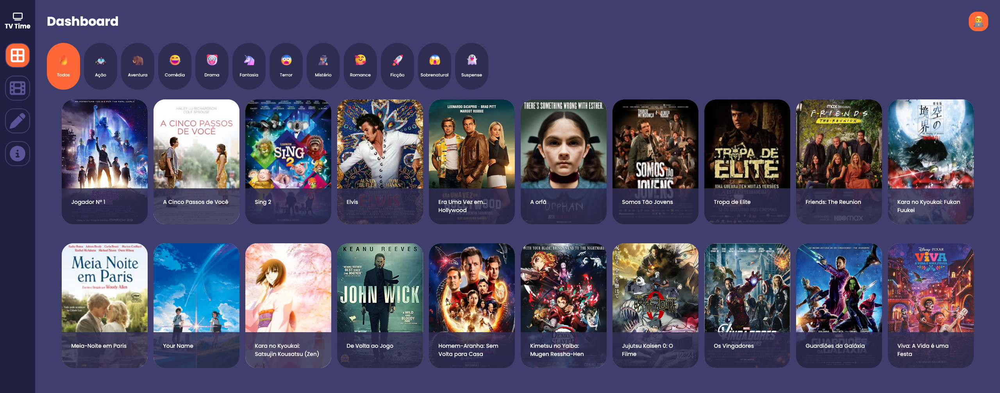

<div align="center" id="top"> 
 
  
  &#xa0;

 <a href="https://tvtime-app.vercel.app" target="_blank">Demo</a>
 <a href="https://www.youtube.com/watch?v=UAJZuWCtmU0" target="_blank">Video</a>
</div>

<h1 align="center">TV Time App</h1>

<p align="center">
  

  

  
</p>

<!-- Status 

<h4 align="center"> 
	🚧  TV Time App 🚀 Under construction...  🚧
</h4>

<hr>-->

<p align="center">
  <a href="#dart-about">About</a> &#xa0; | &#xa0; 
  <a href="#sparkles-features">Features</a> &#xa0; | &#xa0;
  <a href="#rocket-technologies">Technologies</a> &#xa0; | &#xa0;
  <a href="#white_check_mark-requirements">Requirements</a> &#xa0; | &#xa0;
  <a href="#checkered_flag-starting">Starting</a> &#xa0; | &#xa0;
  <!-- <a href="#memo-license">License</a> &#xa0; | &#xa0; -->
  <a href="#memo-authors">Authors</a>
</p>

<br>



## :dart: About ##

In this project, a reinterpretation of the TV Time application was developed as an evaluation from the Database I subject.

## :sparkles: Features ##

:heavy_check_mark: &nbsp;Shows the whole movies list on the Home page;\
:heavy_check_mark: &nbsp;Shows movies filtered by genres;\
:heavy_check_mark: &nbsp;Shows movies details when clicking on it;\
:heavy_check_mark: &nbsp;As an admin user, it's possible to see movies registered and delete or update them;\
:heavy_check_mark: &nbsp;As an admin user, it's possible to register new movies

## :rocket: Technologies ##

The following tools were used in this project:

- [Vite](https://vitejs.dev/)
- [Node.js](https://nodejs.org/en/)
- [React](https://pt-br.reactjs.org/)
- [TypeScript](https://www.typescriptlang.org/)
- [Axios](https://axios-http.com/ptbr/docs/intro)


## :white_check_mark: Requirements ##

Before starting :checkered_flag:, you need to have [Git](https://git-scm.com) and [Node](https://nodejs.org/en/)  installed.

## :checkered_flag: Starting ##
Server

```bash
# Clone this project
$ git clone https://github.com/oliveiralecca/university-tvtime-app

# Access
$ cd university-tvtime-app
$ cd backend

# Install dependencies
$ yarn or npm i

# Run the project
$ yarn dev or npm run dev

# The server will initialize in the <http://localhost:3000>
```

Web

```bash
# Access
$ cd university-tvtime-app
$ cd frontend

# Install dependencies
$ yarn or npm i

# Run the project
$ yarn dev or npm run dev

# The project will initialize in the <http://localhost:5173>
```

<!-- ## :memo: License ##

This project is under license from MIT. For more details, see the [LICENSE](LICENSE) file. -->

## :memo: Authors ##

- [Letícia Oliveira](https://github.com/oliveiralecca)
- [Marcos Paulo](https://github.com/mpaullos)
- [Rodrigo Santana](https://github.com/rodrigodesan)

&#xa0;

<a href="#top">Back to top :top:</a>
